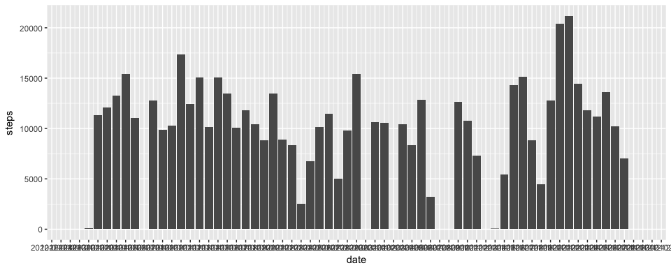
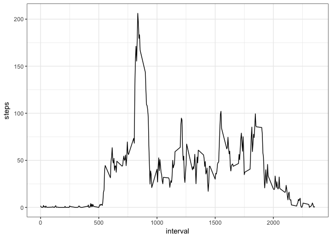
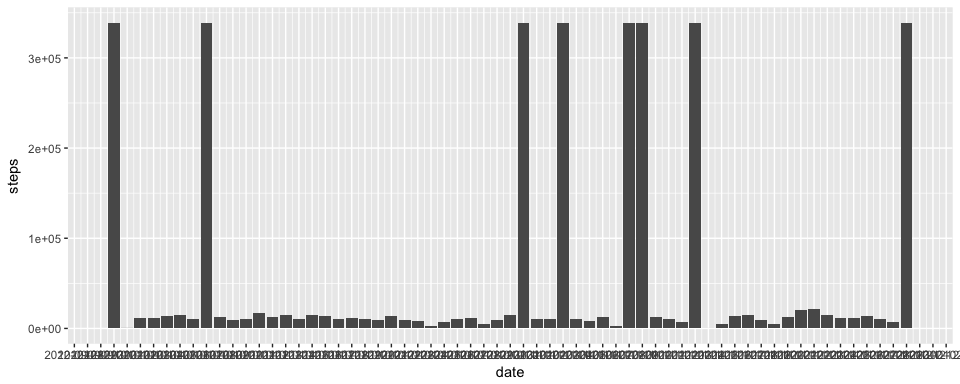
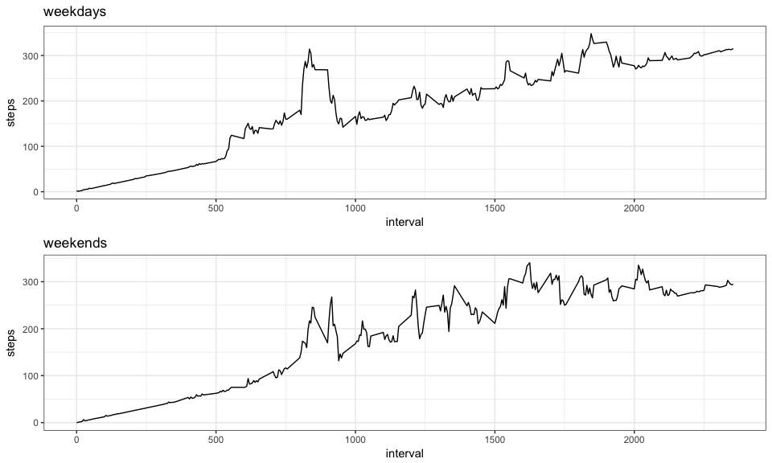

## Loading and preprocessing the data

```r
data = read.csv("~/Documents/personal/Courses/3rd year/6th sem/Data Science john hopkins (PE2)/5. Reproducible research/activity.csv")
data$date = as.Date(data$date)

# adding necessary libraries for functions
library(dplyr)
```

```
## 
## Attaching package: 'dplyr'
```

```
## The following objects are masked from 'package:stats':
## 
##     filter, lag
```

```
## The following objects are masked from 'package:base':
## 
##     intersect, setdiff, setequal, union
```

```r
library(ggplot2)
library(gridExtra)
```

```
## 
## Attaching package: 'gridExtra'
```

```
## The following object is masked from 'package:dplyr':
## 
##     combine
```


## What is mean total number of steps taken per day?

#dataframe for total number of steps taken per day

```r
steps_per_day <-data%>%select(date,steps)%>%group_by(date)%>%summarise(daily_steps=sum(steps,na.rm = TRUE))
colnames(steps_per_day) = c("date", "steps")
head(steps_per_day)
```

```
## # A tibble: 6 x 2
##   date       steps
##   <date>     <int>
## 1 2012-10-01     0
## 2 2012-10-02   126
## 3 2012-10-03 11352
## 4 2012-10-04 12116
## 5 2012-10-05 13294
## 6 2012-10-06 15420
```

#histogram for the total number of steps taken per day

```r
p = ggplot(steps_per_day, aes(x=date, y=steps)) + 
    geom_bar(stat="identity")+ scale_x_date(date_breaks="1 day" )
print(p)
```

<!-- -->

#mean and median of number of steps taken per day

```r
mean(steps_per_day$steps)
```

```
## [1] 9354.23
```

```r
median(steps_per_day$steps)
```

```
## [1] 10395
```


## What is the average daily activity pattern?

#dataframe containing average number of steps taken per interval 

```r
steps_per_interval <- data%>%select(interval,steps)%>%group_by(interval)%>%summarise(steps=mean(steps,na.rm = TRUE))
colnames(steps_per_interval) <- c("interval", "steps")
head(steps_per_interval)
```

```
## # A tibble: 6 x 2
##   interval  steps
##      <int>  <dbl>
## 1        0 1.72  
## 2        5 0.340 
## 3       10 0.132 
## 4       15 0.151 
## 5       20 0.0755
## 6       25 2.09
```

```r
p2<-ggplot(steps_per_interval, aes(interval, steps)) + geom_line() + theme_bw()
print(p2)
```

<!-- -->

#finding the interval with the maximum number of steps

```r
steps_per_interval[which.max(steps_per_interval$steps),]$interval
```

```
## [1] 835
```


## Imputing missing values

#calculating total number of missing values


```r
sum(is.na(data$steps))
```

```
## [1] 2304
```
#replacing missing value with the mean value observed for that interval, and creating new updated data set(data_imputed)


```r
data_imputed = data
for (i in 1:nrow(data_imputed))
{
    row = data_imputed[i,]
    
    if (is.na(row$steps))
        data_imputed[i,"steps"] = steps_per_interval[which(steps_per_interval$interval == row$interval),1]
        
        # floor(steps_per_interval[steps_per_interval$interval==row$interval,]$steps)
}
```

#updated dataframe for total number of steps taken per day


```r
steps_per_day_updated <-data_imputed%>%select(date,steps)%>%group_by(date)%>%summarise(daily_steps=sum(steps,na.rm = TRUE))
colnames(steps_per_day_updated) = c("date", "steps")
head(steps_per_day_updated)
```

```
## # A tibble: 6 x 2
##   date        steps
##   <date>      <int>
## 1 2012-10-01 339120
## 2 2012-10-02    126
## 3 2012-10-03  11352
## 4 2012-10-04  12116
## 5 2012-10-05  13294
## 6 2012-10-06  15420
```
#updated histogram for the total number of steps taken per day

```r
p3 = ggplot(steps_per_day_updated, aes(x=date, y=steps)) + 
    geom_bar(stat="identity")+ scale_x_date(date_breaks="1 day" )
print(p3)
```

<!-- -->
#mean and median of number of steps taken per day

```r
mean(steps_per_day_updated$steps)
```

```
## [1] 53828.98
```

```r
median(steps_per_day_updated$steps)
```

```
## [1] 11458
```
#these updated values for mean and median do differ from the original mean and median


## Are there differences in activity patterns between weekdays and weekends?

#update the imputed dataframe by adding a column indicating it as a weekday or not

```r
data_imputed_days = data_imputed
data_imputed_days$daytype = ifelse(weekdays(data_imputed_days$date) %in% c("Saturday", "Sunday"),
                                       "weekend",
                                       "weekday")
data_imputed_days$daytype <- as.factor(data_imputed_days$daytype)

head(data_imputed_days)
```

```
##   steps       date interval daytype
## 1     0 2012-10-01        0 weekday
## 2     5 2012-10-01        5 weekday
## 3    10 2012-10-01       10 weekday
## 4    15 2012-10-01       15 weekday
## 5    20 2012-10-01       20 weekday
## 6    25 2012-10-01       25 weekday
```

#create a plot containing average number of steps per interval on weekdays and weekends

```r
# plot for weekends
data_weekend = data_imputed_days[data_imputed_days$daytype == "weekend", ]
data_weekend_steps_per_interval = aggregate(data_weekend$steps, 
                                  by=list(interval=data_weekend$interval), 
                                  FUN=mean)
colnames(data_weekend_steps_per_interval) = c("interval", "steps")
p4 = ggplot(data_weekend_steps_per_interval, aes(interval, steps)) + 
    geom_line() + theme_bw()  + ggtitle("weekends")
# plot for weekdays
data_weekday = data_imputed_days[data_imputed_days$daytype == "weekday", ]
data_weekday_steps_per_interval = aggregate(data_weekday$steps, 
                                    by=list(interval=data_weekday$interval), 
                                    FUN=mean)
colnames(data_weekday_steps_per_interval) = c("interval", "steps")
p5 = ggplot(data_weekday_steps_per_interval, aes(interval, steps)) + 
    geom_line() + theme_bw()  + ggtitle("weekdays")
# stack plots
grid.arrange(p5, p4, nrow=2)
```

<!-- -->

